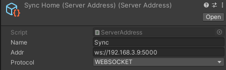
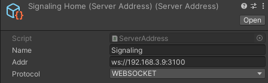

# TLabNetworkedVR
Multiplayer networking solution for VR applications.

## Protocol

| Sync Target                    | Protocol  | 
| ------------------------------ | --------- | 
| Transform (or Rigidbody)       | WebRTC    | 
| Animator (Not fully supported) | WebSocket | 

| Message Type                 | Protocol  | 
| ---------------------------- | --------- | 
| Voice Chat                   | WebRTC    | 
| Custom Message (Json Format) | WebSocket | 

## Getting Started

### Prerequisites
- Unity 2021.3.23f1  
- Oculus Integration (Install from asset store)  
- node (v16.15.0)
- [unity.webrtc](https://github.com/Unity-Technologies/com.unity.webrtc)
- [NativeWebsocket](https://github.com/endel/NativeWebSocket)

### Server Set Up
- [TLabNetworkedVR](https://github.com/TLabAltoh/TLabNetworkedVR-Server.git)

1. Set the SignalingServer and SyncServer addresses in Unity
<table>
<tr>
	<td>
		
	</td>
</tr>
	<td>
		
	</td>
	<td>
		
	</td>
</tr>
</table>

2. Execute the following commands in TLabNetworkedVR-Server/SyncServer

```
npm start
```

or

```
start.bat
```

3. Execute the following commands in TLabNetworkedVR-Server/WebRTCSignaling

```
npm start
```

or

```
start.bat
```

## Sample Project
[VR_Classroom](https://github.com/TLabAltoh/VR_Classroom.git)
