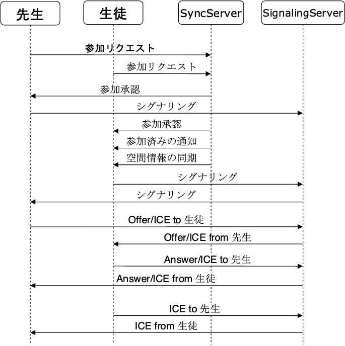
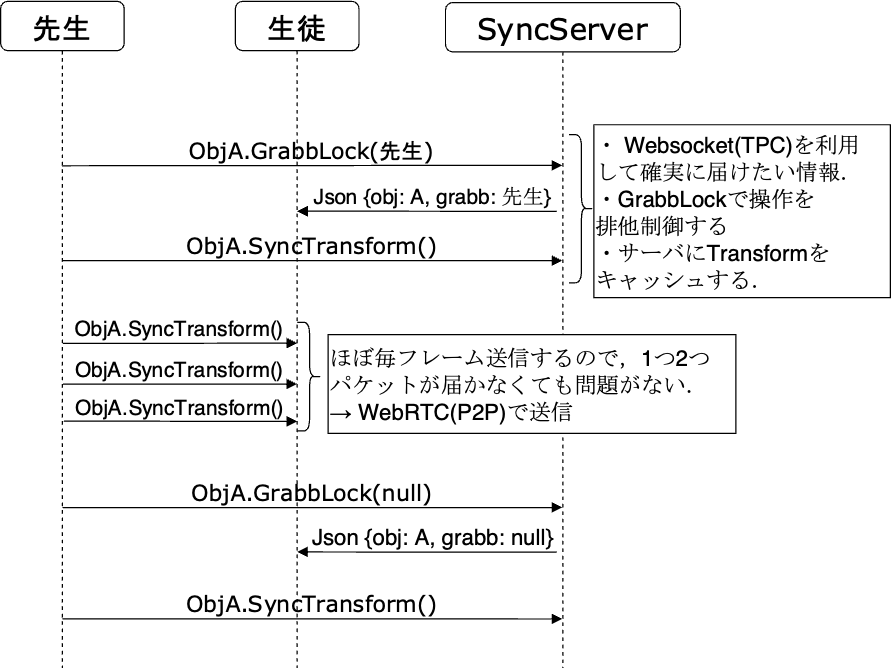
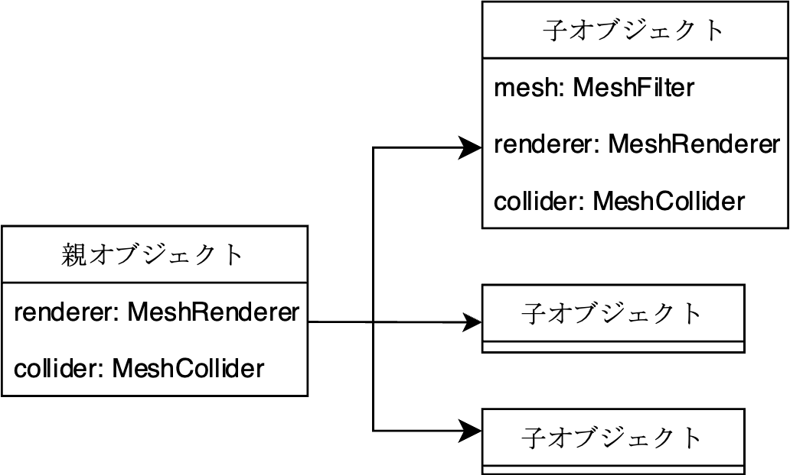

# TLabNetworkedVR
For VR development in Unity  
Assets supporting synchronisation of objects in VR space  

## Note
- TLabVRGrabber has been renamed TLabNetworkedVR due to expanded functionality.
- Due to continued destructive updates, I recommend those who want to use the stable version to download the package from the release.

## Features
- Supports both hand tracking and controllers
- Rigidbody Synchronization
- VoiceChat
- Websocket and P2P together
- Sync Animator

## Screenshot
[Image is an example of a project using this asset](https://github.com/TLabAltoh/VR_Classroom)  
<table>
<tr>
   <td> 
      
   </td>
   <td> 
      
   </td>
</tr>
</table>

## Getting Started

### Prerequisites
- Unity 2021.3.23f1  
- Oculus Integration (Install from asset store)  
- node (v16.15.0)
- [NativeWebsocket](https://github.com/endel/NativeWebSocket)

### Installing
Clone the repository or download it from the release, place it under any Unity project and use it

### Tutorial
Please refer to the [sample project](https://github.com/TLabAltoh/VR_Classroom) that uses this asset, which describes how to set up the server.  
I am planning to release a simpler sample project in the future.

## System Design Overview
### Network
<table>
<tr>
   <td> 
      
   </td>
   <td> 
      
   </td>
</tr>
</table>

### Object Divide
<table>
<tr>
   <td> 
      
   </td>
</tr>
</table>

## Link
- [Sample project using this asset](https://github.com/TLabAltoh/VR_Classroom)  
- [See below for the multiplayer server code](https://github.com/TLabAltoh/VR_Classroom/tree/master/Server/)
